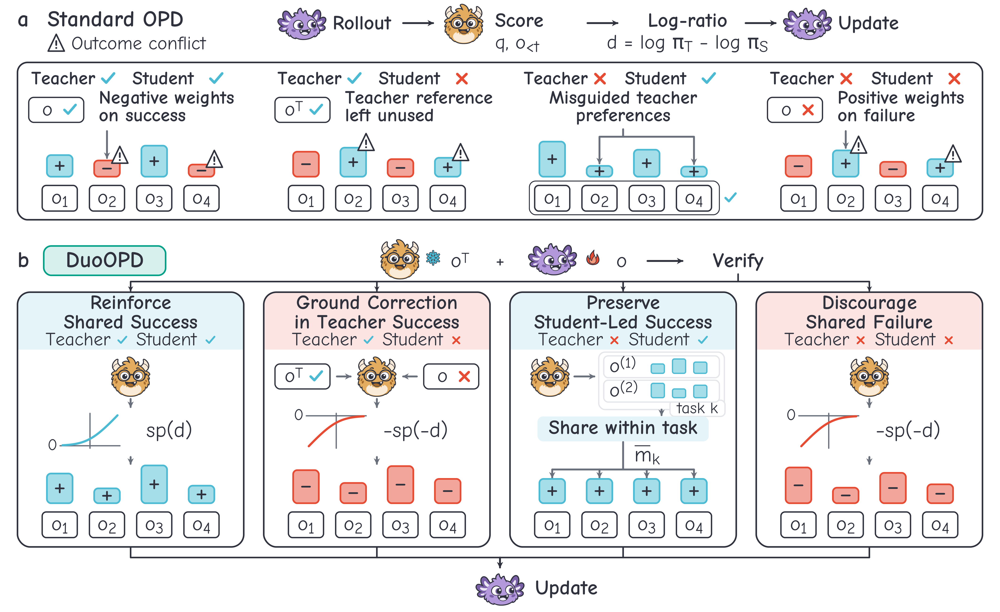

# DuoOPD
[](https://yongyuandeao.github.io/DuoOPD/)
[](https://arxiv.org/abs/2609.33711)
[](https://huggingface.co/papers/2609.33711)
[](LICENSE)

We propose **DuoOPD**, an on-policy distillation method that learns from joint teacher-student outcomes. The student's verified outcome sets the direction of feedback, and the joint outcome decides how the teacher supports it: when only the teacher succeeds, its verified answer becomes context for scoring the student's response; when only the student succeeds, a weight shared within the task reinforces the whole response. One rule covers all four outcomes across tasks, without task-specific settings.



## Installation
Our code is based on [verl](https://github.com/verl-project/verl) (v0.7.0), bundled in `external/verl`. Use Linux, Python 3.10, and CUDA 12.8; MBPP verification also needs [Bubblewrap](https://github.com/containers/bubblewrap) (`bwrap`).

```bash
pip install -r requirements.txt
pip install flash-attn==2.8.3 --no-build-isolation
pip install --no-deps --no-build-isolation -e external/verl
python -m nltk.downloader -d nltk_data punkt_tab
```

Place the models (or symlinks) under `models/`: `Qwen3-0.6B` and `Qwen3-4B`, or `Llama-3.2-3B-Instruct` and `Llama-3.1-8B-Instruct`.

## Training
The processed data splits and teacher caches are in [`data/`](data/README.md), which also describes their sources and how to rebuild them.

Each configuration trains on four GPUs with seed 42:

```bash
bash configs/qwen/duoopd/train.sh
```

| Configuration | Experiment |
| --- | --- |
| `configs/qwen/duoopd` | Biology / chemistry / physics, Qwen3-4B → Qwen3-0.6B |
| `configs/qwen/opd` | Sampled-token OPD baseline, same setting |
| `configs/llama/duoopd` | Biology / chemistry / physics, Llama-3.1-8B → Llama-3.2-3B |
| `configs/science/duoopd` | Materials knowledge / chemistry understanding / physics calculation |
| `configs/heterogeneous/duoopd` | Physics / instruction following / code generation |

Ablations are Hydra overrides appended to the training command, each with its own `RUN_DIR`:

```bash
RUN_DIR=outputs/qwen/no-reference bash configs/qwen/duoopd/train.sh +algorithm.duoopd.teacher_reference=false
```

| Ablation | Override |
| --- | --- |
| w/o reference | `+algorithm.duoopd.teacher_reference=false` |
| w/o sharing | `+algorithm.duoopd.online_mean=false ~algorithm.duoopd.online_mean_scope` |
| w/o both | `+algorithm.duoopd.teacher_reference=false +algorithm.duoopd.online_mean=false ~algorithm.duoopd.online_mean_scope` |
| Sharing across tasks | `algorithm.duoopd.online_mean_scope=batch` |
| One outcome restored to OPD | `+algorithm.duoopd.opd_cell=teacher_only` (or `student_only`, `shared_success`, `shared_failure`) |

The paper reports three runs per setting; for the other two, set `data.seed`, `actor_rollout_ref.actor.data_loader_seed`, and `actor_rollout_ref.rollout.seed` to 43 or 44.

To generate a new teacher cache, run `python -m data.prepare_teacher_references --config configs/teachers/qwen.json` after `source env.sh`.

## Evaluation
Evaluate the checkpoint after update 60 on one GPU:

```bash
CUDA_VISIBLE_DEVICES=0 bash configs/qwen/duoopd/evaluate.sh
```

We report avg@8, the mean success over eight sampled answers per question; Macro averages tasks equally. Results are written to `outputs/<setting>/<method>/evaluation/summary.json`.

## Acknowledgments
Our training code is based on [verl](https://github.com/verl-project/verl). Instruction-following evaluation uses the official [IFEval](https://github.com/google-research/google-research/tree/master/instruction_following_eval) checkers and the RLVR-IFeval checks from [Open Instruct](https://github.com/allenai/open-instruct). Tasks come from [SciKnowEval](https://github.com/HICAI-ZJU/sciknoweval), [RLVR-IFeval](https://huggingface.co/datasets/allenai/RLVR-IFeval), IFEval, and [MBPP](https://github.com/google-research/google-research/tree/master/mbpp). Third-party licenses are listed in [THIRD_PARTY.md](THIRD_PARTY.md).

## Citation
If you find our work helpful, please cite:
```bibtex
@article{yu2026duoopd,
  title={DuoOPD: Learning from Joint Teacher-Student Outcomes for Multi-Task On-Policy Distillation},
  author={Yu, Ao and Gao, Weibo and Zhou, Heng and Yue, Linan and Li, Rui and Liu, Suyi and Yan, Yu and Zhang, Yizhong and Liu, Qi},
  journal={arXiv preprint arXiv:2609.33711},
  year={2026}
}
```
